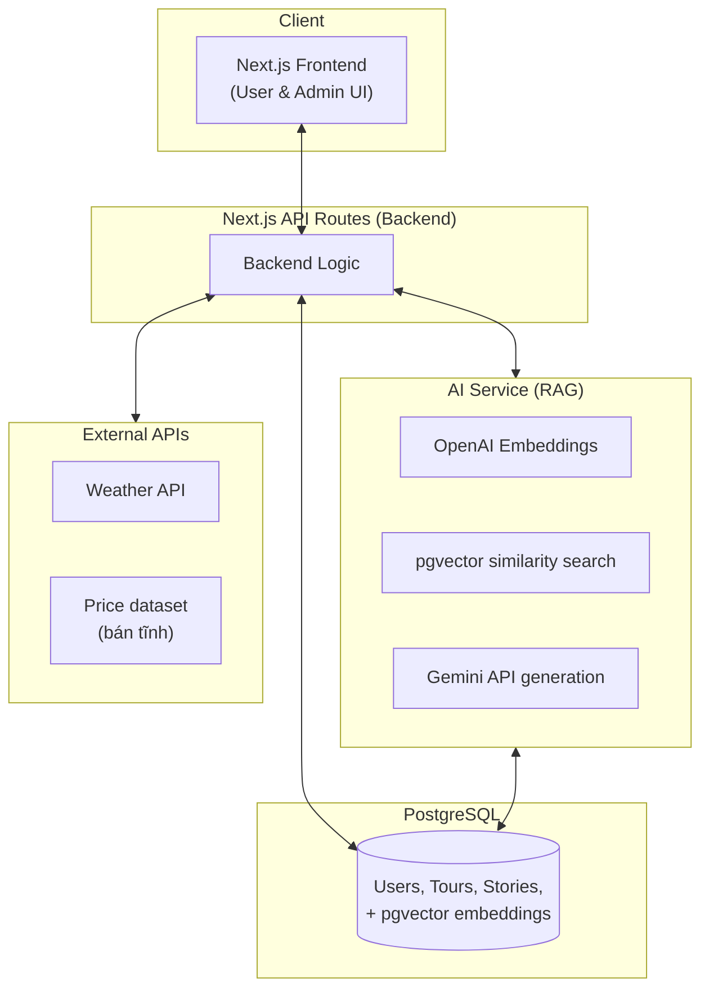

# SmartTripVietNam

Website du lịch **Huế - Đà Nẵng - Hội An** tích hợp trợ lý AI gợi ý lịch trình cá nhân hóa, sử dụng kiến trúc **RAG (Retrieval-Augmented Generation)**.

> Đồ án ngành — Xây dựng nền tảng du lịch tập trung, kết hợp cơ sở dữ liệu du lịch có cấu trúc và trợ lý AI hiểu ngôn ngữ tự nhiên, giúp du khách tra cứu thông tin và lập lịch trình mà không cần phụ thuộc hoàn toàn vào công ty lữ hành.

---

## Mục lục

- [Giới thiệu](#giới-thiệu)
- [Tính năng chính](#tính-năng-chính)
- [Đối tượng sử dụng (Actor)](#đối-tượng-sử-dụng-actor)
- [Công nghệ sử dụng](#công-nghệ-sử-dụng)
- [Kiến trúc hệ thống](#kiến-trúc-hệ-thống)
- [Cấu trúc thư mục](#cấu-trúc-thư-mục)
- [Cơ sở dữ liệu](#cơ-sở-dữ-liệu)
- [Bắt đầu nhanh](#bắt-đầu-nhanh)
- [Biến môi trường](#biến-môi-trường)
- [Scripts](#scripts)
- [Phạm vi & giới hạn](#phạm-vi--giới-hạn)
- [Lộ trình phát triển](#lộ-trình-phát-triển)

---

## Giới thiệu

Miền Trung Việt Nam, đặc biệt cụm ba địa phương Huế - Đà Nẵng - Hội An, sở hữu hệ thống di sản văn hóa, thiên nhiên và ẩm thực đặc trưng. Tuy nhiên du khách — nhất là khách quốc tế và khách lần đầu đến — thường khó tìm thông tin đáng tin cậy và khó tự lên lịch trình phù hợp với độ tuổi, ngân sách, sở thích cá nhân.

**SmartTripVietNam** giải quyết vấn đề này bằng cách kết hợp:
- Một cơ sở dữ liệu du lịch có cấu trúc (địa danh, ẩm thực, lịch sử, tour).
- Một trợ lý AI dùng kiến trúc RAG để sinh lịch trình cá nhân hóa từ yêu cầu ngôn ngữ tự nhiên.

## Tính năng chính

### Người dùng (User)
- Đăng ký / đăng nhập (email hoặc OAuth Google).
- Xem thông tin địa danh, ẩm thực, lịch sử tại Huế, Đà Nẵng, Hội An.
- Đăng story kèm hình ảnh, bình luận và like trên story của người khác.
- Trò chuyện với AI để lập lịch trình theo độ tuổi, ngân sách, số ngày, sở thích.
- Xem, lưu, chỉnh sửa lịch trình do AI đề xuất (VD: "đổi ngày 2 sang biển thay vì di tích").

### Quản trị viên (Admin)
- CRUD địa danh, món ăn, lịch sử, tour mẫu.
- Kiểm duyệt story/comment (duyệt, ẩn, xóa nội dung vi phạm).
- Thống kê lượt dùng AI, địa danh được quan tâm nhiều nhất.

### Hệ thống AI (RAG Pipeline)
- Ingest & embedding hóa dữ liệu địa danh/ẩm thực (OpenAI Embeddings).
- Truy vấn ngữ nghĩa (similarity search) trên pgvector.
- Sinh lịch trình dạng JSON có cấu trúc qua Gemini API.
- Tích hợp Weather API để cảnh báo/gợi ý theo thời tiết từng ngày.

## Đối tượng sử dụng (Actor)

| Actor | Vai trò |
|---|---|
| Khách du lịch (User) | Xem thông tin, chia sẻ trải nghiệm, tương tác với AI lập lịch trình |
| Quản trị viên (Admin) | Quản lý nội dung, kiểm duyệt, theo dõi thống kê |
| Hệ thống AI (Internal Service) | NLU, retrieval (RAG), sinh lịch trình qua Gemini API |

## Công nghệ sử dụng

| Thành phần | Công nghệ |
|---|---|
| Frontend | Next.js (React, App Router) + TypeScript + Tailwind CSS |
| Backend | Next.js API Routes (Node.js) |
| Cơ sở dữ liệu quan hệ | PostgreSQL |
| Cơ sở dữ liệu vector (RAG) | pgvector (extension của PostgreSQL) |
| Embedding model | OpenAI Embeddings (text-embedding-3-small/large) |
| LLM sinh lịch trình | Gemini API (Google) |
| Xác thực | NextAuth.js (JWT) |
| API thời tiết | OpenWeatherMap / VisualCrossing |

> **Lưu ý thiết kế**: Dùng pgvector giúp tận dụng luôn PostgreSQL đã chọn làm database chính, tránh phải vận hành thêm một vector database riêng biệt (Pinecone, Weaviate...), giảm độ phức tạp hạ tầng cho một đồ án sinh viên.

## Kiến trúc hệ thống



**Luồng xử lý khi người dùng yêu cầu lập lịch trình:**

1. User nhập yêu cầu (form hoặc chat tự nhiên) → Backend.
2. Backend gửi query đến AI Service.
3. AI Service tạo embedding cho query (OpenAI) → similarity search trong pgvector.
4. Kết quả truy xuất + yêu cầu gốc → prompt → Gemini API.
5. Gemini sinh lịch trình dạng JSON có cấu trúc (ngày, giờ, địa điểm, chi phí, ghi chú).
6. Backend gọi Weather API để bổ sung cảnh báo thời tiết từng ngày.
7. Kết quả trả về Frontend, hiển thị dưới dạng timeline trực quan.

## Cấu trúc thư mục

```
src/
├── app/                       # Route của ứng dụng (App Router)
│   ├── (auth)/                 # Route Group cho Đăng ký / Đăng nhập
│   ├── (main)/                 # Route Group cho người dùng (Khách du lịch)
│   │   ├── page.tsx            # Trang chủ
│   │   ├── destinations/       # Trang danh sách địa danh
│   │   ├── planner/            # Trang trợ lý AI lập lịch trình
│   │   └── stories/            # Trang chia sẻ trải nghiệm
│   ├── admin/                  # Không gian riêng cho Quản trị viên (CRUD)
│   └── api/                    # Backend API Routes (Node.js/Next API)
│       ├── ai/                 # API xử lý RAG và gọi Gemini API
│       ├── destinations/       # API cho địa danh
│       └── webhooks/           # API nhận dữ liệu từ bên thứ 3
│
├── components/                # Component UI dùng chung
│   ├── common/                 # Button, Input, Modal, v.v.
│   ├── layout/                 # Header, Footer, Sidebar (cho Admin)
│   └── features/               # Component phức tạp (ItineraryTimeline, StoryCard)
│
├── lib/                        # Cấu hình thư viện bên thứ 3 và core logic
│   ├── db.ts                   # Kết nối PostgreSQL (Singleton pattern)
│   ├── pgvector.ts              # Cấu hình query cho vector database
│   └── auth.ts                  # Cấu hình JWT / NextAuth
│
├── services/                   # Business Logic (giữ API routes mỏng)
│   ├── ai.service.ts            # Gọi OpenAI Embeddings và Gemini API
│   ├── rag.service.ts           # Truy vấn ngữ nghĩa (Retrieval)
│   └── destination.service.ts   # Lấy thông tin địa danh từ DB
│
├── hooks/                      # Custom React Hooks (useItinerary, useWeather)
├── types/                      # TypeScript Interfaces/Types
│   ├── index.ts                 # Type cho User, Destination, Itinerary
│   └── ai.ts                    # Cấu trúc JSON trả về từ AI
│
├── utils/                      # Hàm helper dùng chung
│   ├── format.ts                # Format tiền tệ, ngày tháng
│   └── error-handler.ts         # Xử lý lỗi tập trung (Decorator pattern)
│
└── constants/                  # Biến hằng số
    └── index.ts                  # Cấu hình tĩnh, danh sách khu vực (Huế, Đà Nẵng, Hội An)
```

## Cơ sở dữ liệu

| Bảng | Mô tả |
|---|---|
| `users` | Thông tin tài khoản, vai trò (user/admin) |
| `destinations` | Địa danh: tên, địa chỉ, loại hình, mô tả, lịch sử, khu vực |
| `destination_embeddings` | Vector embedding nội dung địa danh (pgvector) |
| `cuisines` | Món ăn đặc trưng: tên, mô tả, địa điểm gợi ý |
| `tours` | Tour mẫu do admin tạo (tên, mô tả, giá tham khảo, thời lượng) |
| `stories` | Bài chia sẻ trải nghiệm (nội dung, hình ảnh, địa danh liên quan) |
| `comments` | Bình luận trên story |
| `price_reference` | Giá tham khảo khách sạn/vé tham quan theo khu vực và mùa |
| `itineraries` | Lịch trình do AI sinh ra, gắn với user, lưu dạng JSON |

## Bắt đầu nhanh

### Yêu cầu
- Node.js ≥ 20
- Tài khoản Supabase hoặc Neon (Postgres có pgvector)
- API key: OpenAI, Gemini, Weather

### Cài đặt

```bash
git clone https://github.com/<your-username>/smarttripvietnam.git
cd smarttripvietnam
npm install
cp .env.local.example .env.local   # điền các biến môi trường
npm run dev
```

Mở [http://localhost:3000](http://localhost:3000) để xem.

## Biến môi trường

Xem chi tiết trong `.env.local.example`:

```
DATABASE_URL=              # Supabase / Neon (Postgres + pgvector)
NEXTAUTH_SECRET=
NEXTAUTH_URL=http://localhost:3000
GOOGLE_CLIENT_ID=
GOOGLE_CLIENT_SECRET=
OPENAI_API_KEY=
GEMINI_API_KEY=
WEATHER_API_KEY=
```

## Scripts

| Lệnh | Mô tả |
|---|---|
| `npm run dev` | Chạy môi trường phát triển |
| `npm run build` | Build production |
| `npm run start` | Chạy bản build production |
| `npm run lint` | Kiểm tra lỗi ESLint |

## Phạm vi & giới hạn

- **Phạm vi địa lý**: giới hạn 3 địa phương — Huế, Đà Nẵng, Hội An.
- **Dữ liệu giá**: dùng bộ dữ liệu giá khách sạn/dịch vụ mang tính đại diện (thu thập thủ công, cập nhật định kỳ), không lấy real-time từ Booking/Agoda do giới hạn API public.
- **Đa ngôn ngữ**: hỗ trợ tối thiểu Việt - Anh.

| Rủi ro | Giải pháp |
|---|---|
| Không lấy được giá real-time | Dataset giá tham khảo tự thu thập, nêu rõ là hướng mở rộng |
| Chi phí gọi API khi demo | Giới hạn request khi test, cache embedding (chỉ embed 1 lần khi ingest) |
| Phạm vi dễ dàn trải | Ưu tiên đầu tư sâu cho module RAG; các chức năng khác làm vừa đủ hoàn chỉnh |

## Lộ trình phát triển

| Tuần | Trọng tâm |
|---|---|
| 1 | Setup Next.js/TS/Tailwind, DB, Auth |
| 2 | Database đầy đủ + CRUD Admin |
| 3 | Auth hoàn chỉnh + Story/Comment |
| 4 | RAG: ingest + embedding |
| 5 | RAG: generation (Gemini) + Weather API |
| 6 | UI cho AI planner + Timeline |
| 7 | Testing |
| 8 | Deploy + hoàn thiện chức năng |
| 9 | Hoàn thiện báo cáo + buffer |

---

*Đồ án ngành — SmartTripVietNam © 2026*
