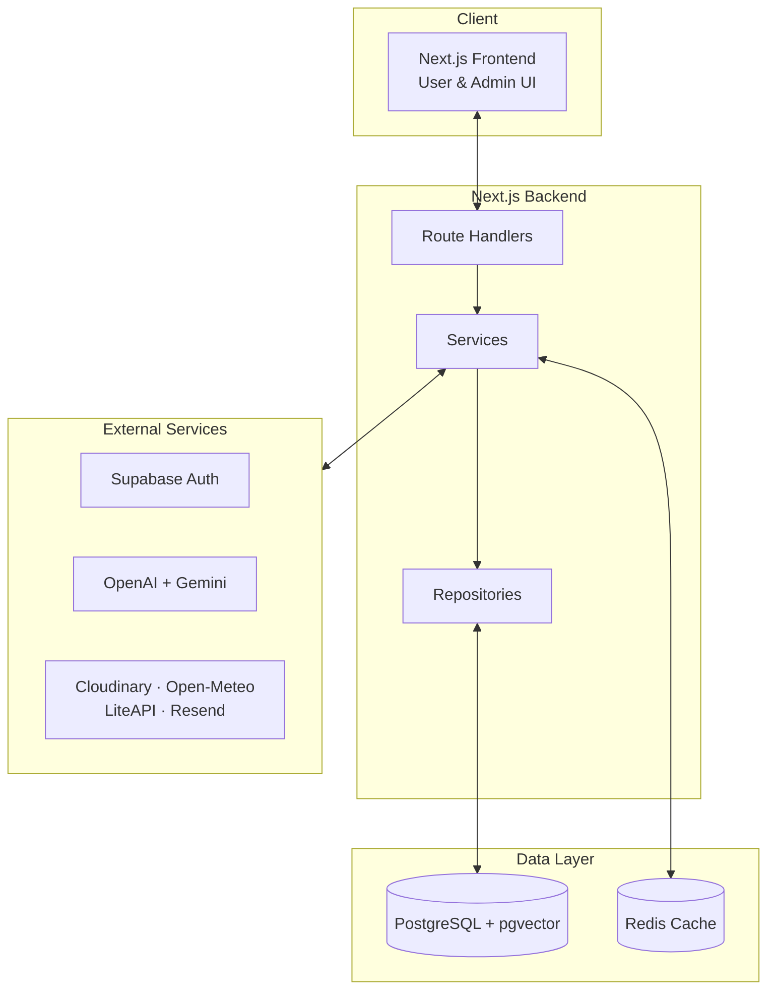

# SmartTripVietNam

Website du lịch **Huế - Đà Nẵng - Hội An** tích hợp trợ lý AI gợi ý lịch trình cá nhân hóa, sử dụng kiến trúc **RAG (Retrieval-Augmented Generation)**.

> Đồ án ngành — Xây dựng nền tảng du lịch tập trung, kết hợp cơ sở dữ liệu du lịch có cấu trúc và trợ lý AI hiểu ngôn ngữ tự nhiên, giúp du khách tra cứu thông tin, khám phá ẩm thực, chia sẻ trải nghiệm và tự lập lịch trình phù hợp.

---

## Mục lục

- [Giới thiệu](#giới-thiệu)
- [Tính năng chính](#tính-năng-chính)
- [Đối tượng sử dụng (Actor)](#đối-tượng-sử-dụng-actor)
- [Công nghệ sử dụng](#công-nghệ-sử-dụng)
- [Kiến trúc hệ thống](#kiến-trúc-hệ-thống)
- [Cấu trúc thư mục](#cấu-trúc-thư-mục)
- [Cơ sở dữ liệu](#cơ-sở-dữ-liệu)
- [Bắt đầu nhanh](#bắt-đầu-nhanh)
- [Biến môi trường](#biến-môi-trường)
- [Scripts](#scripts)
- [Phạm vi và giới hạn](#phạm-vi-và-giới-hạn)
- [Lộ trình phát triển](#lộ-trình-phát-triển)

---

## Giới thiệu

Miền Trung Việt Nam, đặc biệt là cụm ba địa phương Huế - Đà Nẵng - Hội An, sở hữu hệ thống di sản văn hóa, thiên nhiên và ẩm thực đặc trưng. Tuy nhiên, du khách lần đầu đến thường gặp khó khăn trong việc tìm kiếm thông tin, lựa chọn địa điểm và xây dựng lịch trình phù hợp với thời gian, ngân sách và sở thích cá nhân.

**SmartTripVietNam** giải quyết vấn đề này bằng cách kết hợp:

- Cơ sở dữ liệu du lịch có cấu trúc gồm địa danh, lịch sử, ẩm thực, nhà hàng và tour mẫu.
- Trợ lý AI sử dụng kiến trúc RAG để sinh lịch trình từ yêu cầu ngôn ngữ tự nhiên.
- Dữ liệu thời tiết từ Open-Meteo để cảnh báo cho các hoạt động ngoài trời.
- Dữ liệu phòng và giá phòng từ LiteAPI để hỗ trợ lựa chọn nơi lưu trú.
- Cộng đồng chia sẻ story, hình ảnh và lịch trình du lịch.

## Tính năng chính

### Người dùng (User)

- Đăng ký và đăng nhập bằng email/mật khẩu hoặc Google OAuth.
- Xác nhận email và duy trì phiên đăng nhập bằng Supabase Auth.
- Đặt lại mật khẩu bằng mã OTP gửi qua Resend.
- Xem, tìm kiếm và lọc địa danh theo Huế, Đà Nẵng và Hội An.
- Xem mô tả, lịch sử, hình ảnh và vị trí của từng địa danh.
- Khám phá món ăn đặc trưng và các nhà hàng gợi ý.
- Xem tour mẫu, lịch trình từng ngày, bữa ăn và chi phí dự kiến.
- Thích, bình luận tour và chuyển tour mẫu thành lịch trình cá nhân.
- Trò chuyện với AI để lập lịch trình theo số ngày, ngân sách, số người và sở thích.
- Kiểm tra thời tiết cho các hoạt động trong lịch trình bằng Open-Meteo.
- Tìm kiếm nơi lưu trú và giá phòng bằng LiteAPI.
- Lưu, xem và xóa lịch trình cá nhân.
- Đăng story kèm nội dung, hình ảnh, địa danh và lịch trình liên quan.
- Thích, lưu, bình luận và báo cáo nội dung cộng đồng.
- Sử dụng lại lịch trình được chia sẻ từ story.
- Cập nhật hồ sơ, ảnh đại diện và xem thông báo.
- Chuyển đổi giao diện giữa tiếng Việt và tiếng Anh.

### Quản trị viên (Admin)

- Quản lý địa danh và hình ảnh địa danh.
- Quản lý món ăn và dữ liệu embedding liên quan.
- Quản lý tour mẫu, ngày tour, hoạt động, bữa ăn và chi phí.
- Quản lý và xóa story vi phạm.
- Tiếp nhận, xử lý hoặc từ chối báo cáo cộng đồng.
- Gửi thông báo cho tác giả khi story bị xóa.
- Xem thống kê điểm đến, ẩm thực, người dùng và story theo tháng.
- Xem địa danh được nhắc đến nhiều và story bị báo cáo nhiều.

### Hệ thống AI (RAG Pipeline)

- Chia nhỏ dữ liệu địa danh và ẩm thực thành các đoạn nội dung.
- Tạo vector 1.536 chiều bằng OpenAI Embeddings.
- Lưu vector trong PostgreSQL bằng extension `pgvector`.
- Truy vấn ngữ nghĩa bằng cosine similarity và chỉ mục HNSW.
- Đưa dữ liệu truy xuất vào Gemini để sinh lịch trình JSON có cấu trúc.
- Kiểm tra địa danh và món ăn do AI chọn phải thuộc RAG context.
- Sử dụng `generationProof` để bảo vệ dữ liệu trước khi lưu lịch trình AI.
- Tích hợp Open-Meteo để kiểm tra dự báo thời tiết.
- Tích hợp LiteAPI để lấy dữ liệu lưu trú và giá phòng.

## Đối tượng sử dụng (Actor)

| Actor | Vai trò |
|---|---|
| Khách chưa đăng nhập | Xem trang chủ, điểm đến, ẩm thực, tour và nội dung cộng đồng |
| Khách du lịch (User) | Tạo lịch trình AI, lưu tour, đăng story và tương tác cộng đồng |
| Quản trị viên (Admin) | Quản lý dữ liệu, kiểm duyệt nội dung và theo dõi thống kê |
| Hệ thống AI | Retrieval RAG, phân tích yêu cầu và sinh lịch trình bằng Gemini |

## Công nghệ sử dụng

| Thành phần | Công nghệ |
|---|---|
| Frontend | Next.js 16, React 19, TypeScript, Tailwind CSS 4 |
| Backend | Next.js Route Handlers |
| Form và Validation | React Hook Form, Zod |
| Cơ sở dữ liệu | PostgreSQL, Drizzle ORM, Drizzle Kit |
| Cơ sở dữ liệu vector | pgvector, HNSW, cosine similarity |
| Embedding model | OpenAI Embeddings (`text-embedding-3-small`) |
| LLM sinh lịch trình | Google Gemini |
| Xác thực | Supabase Auth, Supabase SSR, Google OAuth |
| Phân quyền | `profiles.role` với hai vai trò `user` và `admin` |
| Cache | Redis, ioredis |
| Lưu trữ hình ảnh | Cloudinary |
| API thời tiết | Open-Meteo |
| API lưu trú | LiteAPI / Nuitee Connect |
| Gửi email OTP | Resend |
| Bản đồ | Leaflet và liên kết Google Maps |
| Đa ngôn ngữ | next-intl |
| Tài liệu API | OpenAPI 3.1, Scalar |
| Kiểm thử | Vitest, Testing Library, jsdom |
| Đóng gói ứng dụng | Docker, Docker Compose |

> **Lưu ý thiết kế:** pgvector được cài trực tiếp trên PostgreSQL, giúp hệ thống sử dụng chung một cơ sở dữ liệu cho dữ liệu quan hệ và dữ liệu vector, không cần vận hành thêm Pinecone hoặc Weaviate.

## Kiến trúc hệ thống


```mermaid
flowchart TB
    subgraph Client
        FE["Next.js Frontend<br/>User & Admin UI"]
    end

    subgraph Server["Next.js Backend"]
        API["Route Handlers"]
        SERVICE["Services"]
        REPOSITORY["Repositories"]
    end

    subgraph Data["Data Layer"]
        DB[("PostgreSQL + pgvector")]
        REDIS[("Redis Cache")]
    end

    subgraph External["External Services"]
        AUTH["Supabase Auth"]
        AI["OpenAI + Gemini"]
        OTHER["Cloudinary · Open-Meteo<br/>LiteAPI · Resend"]
    end

    FE <--> API
    API --> SERVICE
    SERVICE --> REPOSITORY
    REPOSITORY <--> DB
    SERVICE <--> REDIS
    SERVICE <--> External
```

**Luồng xử lý khi người dùng yêu cầu lập lịch trình:**

1. Người dùng nhập yêu cầu chuyến đi qua giao diện chat.
2. Backend kiểm tra đăng nhập và xác thực dữ liệu bằng Zod.
3. Hệ thống tạo embedding cho yêu cầu bằng OpenAI.
4. Hệ thống tìm các địa danh và món ăn liên quan trong pgvector.
5. RAG context và yêu cầu người dùng được gửi đến Gemini.
6. Gemini sinh lịch trình JSON gồm ngày, hoạt động, bữa ăn và chi phí.
7. Backend kiểm tra dữ liệu AI và tạo `generationProof`.
8. Khi người dùng xác nhận, lịch trình được lưu vào PostgreSQL.
9. Người dùng có thể kiểm tra thêm thời tiết và nơi lưu trú trong giao diện chat.

## Cấu trúc thư mục

```text
SmartTripVietNam/
├── drizzle/                    # Các file SQL migration của Drizzle
├── messages/                   # Nội dung đa ngôn ngữ Việt - Anh
├── public/                     # Tài nguyên tĩnh
├── scripts/
│   ├── seed.ts                 # Seed địa danh, ẩm thực và tour mẫu
│   ├── seed-community.ts       # Seed dữ liệu cộng đồng
│   ├── seed-restaurants.ts     # Seed dữ liệu nhà hàng demo
│   ├── ingest-rag.ts           # Tạo embeddings cho RAG
│   └── test-rag.ts             # Kiểm tra truy vấn RAG
│
├── src/
│   ├── app/                    # Next.js App Router
│   │   ├── admin/              # Các trang quản trị
│   │   ├── api/                # Backend Route Handlers
│   │   ├── auth/               # Đăng nhập, đăng ký, OTP và callback
│   │   ├── community/          # Cộng đồng và story
│   │   ├── destinations/       # Danh sách và chi tiết địa danh
│   │   ├── food/               # Khám phá ẩm thực
│   │   ├── planner/            # Lịch trình cá nhân và AI Planner
│   │   └── tours/              # Chi tiết tour mẫu
│   │
│   ├── components/             # React components theo từng chức năng
│   ├── constants/              # Enum, nhãn và dữ liệu giao diện tĩnh
│   ├── db/                     # Kết nối PostgreSQL và Drizzle schema
│   ├── hooks/                  # Custom hooks: debounce, pagination
│   ├── i18n/                   # Cấu hình đa ngôn ngữ
│   ├── lib/                    # Supabase, Redis, AI, Cloudinary, OpenAPI
│   ├── openapi/                # Định nghĩa tài liệu OpenAPI
│   ├── repositories/           # Truy vấn cơ sở dữ liệu
│   ├── schemas/                # Zod schemas
│   ├── services/               # Business logic
│   ├── types/                  # TypeScript types
│   └── utils/                  # Hàm tiện ích và API response
│
├── .env.example                # Mẫu biến môi trường
├── compose.yaml                # Docker Compose cho App và Redis
├── Dockerfile                  # Dockerfile production
├── drizzle.config.ts           # Cấu hình Drizzle Kit
├── next.config.ts              # Cấu hình Next.js
└── package.json                # Dependencies và scripts
```

## Cơ sở dữ liệu

| Nhóm bảng | Bảng chính | Mô tả |
|---|---|---|
| Người dùng | `profiles` | Hồ sơ và vai trò người dùng |
| Xác thực | `password_reset_otps` | Mã OTP đặt lại mật khẩu |
| Khu vực | `locations` | Huế, Đà Nẵng và Hội An |
| Địa danh | `destinations`, `destination_images`, `destination_categories` | Thông tin, lịch sử, hình ảnh và danh mục địa danh |
| RAG địa danh | `destination_embeddings` | Vector embedding của địa danh |
| Ẩm thực | `cuisines`, `restaurants` | Món ăn và nhà hàng |
| RAG ẩm thực | `cuisine_embeddings` | Vector embedding của món ăn |
| Tour mẫu | `tour`, `tour_days`, `tour_items`, `tour_meals`, `tour_costs` | Tour do hệ thống hoặc admin quản lý |
| Lịch trình | `user_itineraries`, `itinerary_days`, `itinerary_items`, `itinerary_meals`, `itinerary_stays`, `itinerary_costs` | Lịch trình của người dùng |
| Cộng đồng | `community_posts`, `post_images`, `post_comments`, `post_likes`, `post_saves` | Story và tương tác cộng đồng |
| Kiểm duyệt | `community_reports`, `community_post_deletion_logs` | Báo cáo và nhật ký xóa story |
| Thông báo | `notifications` | Thông báo gửi đến người dùng |

## Bắt đầu nhanh

### Yêu cầu

- Node.js 22 LTS được khuyến nghị.
- PostgreSQL hoặc Supabase có hỗ trợ pgvector.
- Redis hoặc Docker Desktop.
- API key của OpenAI và Gemini nếu sử dụng AI.
- API key Cloudinary nếu sử dụng upload ảnh.
- API key Resend nếu sử dụng OTP.
- API key LiteAPI nếu sử dụng tìm kiếm nơi lưu trú.

### Cài đặt

```bash
git clone https://github.com/nguyentuanduyntd/SmartTripVietNam.git
cd SmartTripVietNam

npm ci

cp .env.example .env.local

docker compose up -d redis

npm run db:migrate
npm run dev
```

Mở [http://localhost:3000](http://localhost:3000) để sử dụng ứng dụng.

Trên Windows PowerShell:

```powershell
Copy-Item .env.example .env.local
```

### Khởi tạo dữ liệu mẫu

Trước khi chạy `db:seed`, hệ thống cần có ít nhất một tài khoản trong bảng `profiles` với `role = 'admin'` vì trường `tour.created_by` bắt buộc tham chiếu đến quản trị viên.

```bash
npm run db:seed
npx tsx scripts/seed-restaurants.ts
npm run db:seed-community
npm run rag:ingest
```

## Biến môi trường

Tạo file `.env.local` dựa trên `.env.example`:

```env
# Supabase
NEXT_PUBLIC_SUPABASE_URL=
NEXT_PUBLIC_SUPABASE_ANON_KEY=
DATABASE_URL=
SUPABASE_SERVICE_ROLE_KEY=

# Cloudinary
CLOUDINARY_CLOUD_NAME=
CLOUDINARY_API_KEY=
CLOUDINARY_API_SECRET=
NEXT_PUBLIC_CLOUDINARY_CLOUD_NAME=

# OpenAI Embeddings
OPENAI_API_KEY=
OPENAI_EMBEDDING_MODEL=text-embedding-3-small

# Google Gemini
GEMINI_API_KEY=
GEMINI_MODEL=

# Bảo vệ kết quả lịch trình AI
AI_ITINERARY_PROOF_SECRET=

# Resend và OTP
RESEND_API_KEY=
RESEND_FROM_EMAIL="SmartTrip <onboarding@resend.dev>"
OTP_HASH_SECRET=

# Redis
REDIS_URL=redis://localhost:6379

# LiteAPI
LITEAPI_API_KEY=

# OpenAPI
NEXT_PUBLIC_APP_URL=http://localhost:3000
```

Tạo secret cho OTP và `generationProof`:

```bash
openssl rand -hex 32
```

> Không commit `.env.local`, `SUPABASE_SERVICE_ROLE_KEY` hoặc các API secret lên GitHub.

## Scripts

| Lệnh | Mô tả |
|---|---|
| `npm run dev` | Chạy môi trường phát triển |
| `npm run build` | Build ứng dụng production |
| `npm run start` | Chạy bản build production |
| `npm run lint` | Kiểm tra ESLint |
| `npm run db:generate` | Tạo migration từ Drizzle schema |
| `npm run db:push` | Đồng bộ schema trực tiếp với database |
| `npm run db:migrate` | Chạy migrations |
| `npm run db:studio` | Mở Drizzle Studio |
| `npm run db:seed` | Seed địa danh, ẩm thực và tour mẫu |
| `npm run db:seed-community` | Seed dữ liệu cộng đồng |
| `npm run db:flush-cache` | Xóa cache Redis |
| `npm run rag:ingest` | Tạo embeddings cho dữ liệu RAG |
| `npm run rag:test` | Kiểm tra truy vấn RAG |
| `npm test` | Chạy Vitest ở chế độ watch |
| `npm run test:unit` | Chạy unit test |
| `npm run test:component` | Chạy component test |
| `npm run test:integration` | Chạy integration test |
| `npm run test:api` | Chạy API contract test |
| `npm run test:coverage` | Chạy test coverage |

### Chạy bằng Docker

```bash
docker compose up -d --build
```

Kiểm tra container:

```bash
docker compose ps
```

Xem log:

```bash
docker compose logs -f app
```

Dừng container:

```bash
docker compose down
```

Xóa cả volume Redis:

```bash
docker compose down -v
```

### Tài liệu API

Sau khi chạy ứng dụng:

- Scalar API Docs: [http://localhost:3000/docs](http://localhost:3000/docs)
- OpenAPI JSON: [http://localhost:3000/openapi.json](http://localhost:3000/openapi.json)
- Redis Health Check: [http://localhost:3000/api/health/redis](http://localhost:3000/api/health/redis)

## Phạm vi và giới hạn

- **Phạm vi địa lý:** tập trung vào Huế, Đà Nẵng và Hội An.
- **Dữ liệu nhà hàng:** dữ liệu trong `seed-restaurants.ts` là dữ liệu demo.
- **Giá phòng:** lấy từ LiteAPI và phụ thuộc vào ngày, số khách và dữ liệu nhà cung cấp.
- **Dự báo thời tiết:** lấy từ Open-Meteo và chỉ khả dụng trong phạm vi ngày API hỗ trợ.
- **Chi phí AI:** ingest RAG và tạo lịch trình phát sinh chi phí OpenAI/Gemini API.
- **Tài liệu API:** OpenAPI hiện mới mô tả Profile, Locations, Destinations và Cuisines.
- **Bảo mật:** API key và service-role key chỉ được sử dụng phía server.

| Rủi ro | Giải pháp |
|---|---|
| AI sinh dữ liệu ngoài nguồn | Kiểm tra destination và cuisine phải thuộc RAG context |
| Dữ liệu AI bị sửa tại client | Xác minh `generationProof` trước khi lưu |
| Gọi API nhiều lần | Redis cache, debounce tìm kiếm và pagination |
| Giá phòng không khả dụng | Cho phép đổi ngày hoặc nới điều kiện tìm kiếm |
| Gemini không khả dụng | Sử dụng fallback cho một số luồng xử lý |

## Lộ trình phát triển

| Hạng mục | Trạng thái |
|---|---|
| Next.js, TypeScript, Tailwind CSS | Hoàn thành |
| Supabase Auth và Google OAuth | Hoàn thành |
| Database và Drizzle migrations | Hoàn thành |
| CRUD địa danh, ẩm thực và tour | Hoàn thành |
| Cộng đồng và kiểm duyệt nội dung | Hoàn thành |
| RAG với OpenAI Embeddings và pgvector | Hoàn thành |
| Sinh lịch trình bằng Gemini | Hoàn thành |
| Open-Meteo và LiteAPI | Hoàn thành |
| Redis cache | Hoàn thành |
| Unit, component và API tests | Đang hoàn thiện |
| CI/CD và triển khai production | Hướng phát triển |

---

*Đồ án ngành — SmartTripVietNam © 2026*
